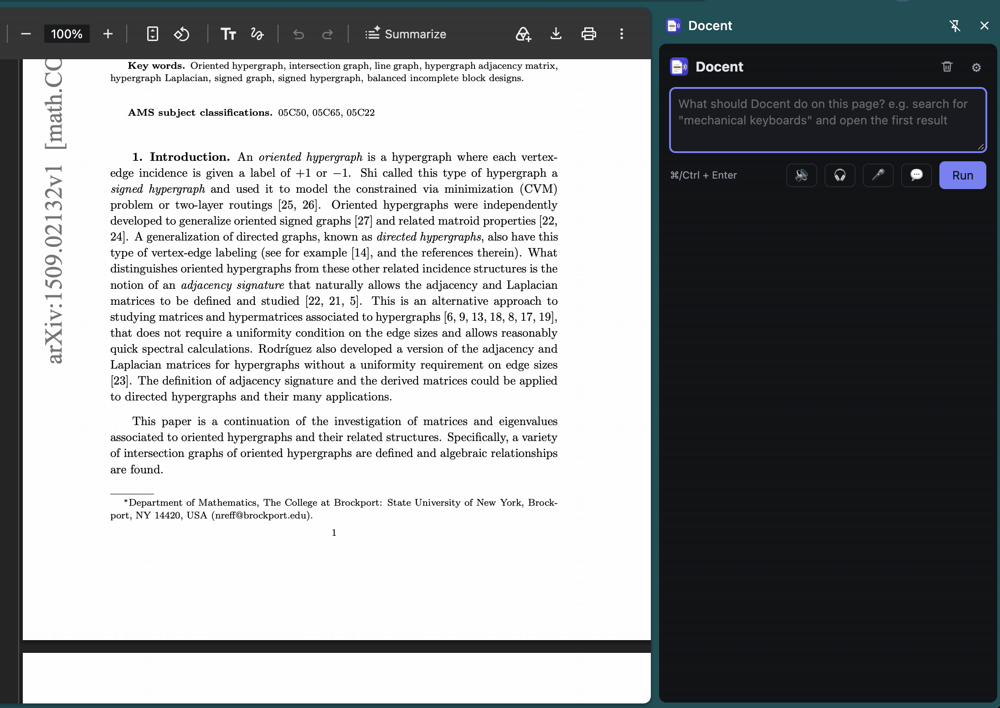

# Docent

A Chrome extension that acts as a guide for the page you're on. Ask it questions about the page, have it summarize or read the page aloud, turn it into a two-voice podcast, highlight or hide things by meaning, restyle the page, or let it click and type for you. You can type, use the mic, or talk with it hands-free.

## Install

1. Download or clone this folder.
2. Open `chrome://extensions` and turn on **Developer mode** (top right).
3. Click **Load unpacked** and choose this folder.
4. Pin Docent from the puzzle-piece menu, then click its icon (or press **Alt+J**).
5. Click ⚙, [choose a decision model](#choose-a-decision-model-jev-or-laya) and, if you want summaries and voice, [set up LiveKit](#set-up-livekit-optional).
6. Click **Save**.

After changing the code, click the reload arrow on Docent's card in `chrome://extensions`.

## Update

Docent tells you when a newer version is on GitHub: a bar appears at the top of the panel, and ⚙ shows your version at the bottom. To update:

1. Run `git pull` in this folder, or download it again and replace the folder.
2. Open `chrome://extensions` and click the reload arrow on Docent's card.

The check runs when you open Docent, at most every 6 hours, and asks GitHub about this repository only. Nothing about you or your pages is sent.

- **A copy cloned with git** reads its own commit from its `.git` folder and asks GitHub how many commits `main` has since then. Every push to `main` counts, so there is no version number to bump.
- **A downloaded copy** (no `.git` folder) compares the `version` in its `manifest.json` with the one on `main`, so it only notices when that number goes up.

## Choose a decision model: Jev or Laya

The decision model makes Docent's small, typed decisions: what kind of request you made, which element to click, whether a post matches, yes or no. It picks from options and doesn't write text. Choose one in ⚙ → *Decision model*.

| | Jev | Laya |
| --- | --- | --- |
| Where it runs | TypeSafe's API | In your browser |
| Needs | A TypeSafe API key | A one-time download of 290 MB or 440 MB |
| Page text sent out | To TypeSafe | Nowhere |
| Speed | About a second a step | Seconds per question on a CPU; faster on a GPU |
| Accuracy | Best | Good at yes/no questions and find/hide; weaker at multi-step tasks |

Pick **Jev** for the best results, especially for tasks that click and type. Pick **Laya** if you don't have a key or don't want page text to leave your browser.

**To set up Jev:**

1. Get an API key from [console.typesafe.ai](https://console.typesafe.ai).
2. Set *Who makes the decisions* to **Jev** and paste the key into *TypeSafe API key*.
3. Leave *Model* (`jev-latest`) and *API base* as they are, and click **Save**.

**To set up Laya:**

1. Set *Who makes the decisions* to **Laya**. The other option, *Laya, typed-decisions checkpoint*, is better at telling tasks from questions and worse at picking the next step.
2. Choose a *Build*: **int4** (290 MB, can use the GPU) or **int8** (440 MB, CPU only, closer to the original model).
3. Leave *Run on* at **Automatic**, which uses the GPU when Chrome has WebGPU and the build is int4.
4. Click **Download & load now**, then **Save**. The model is cached, so it downloads once. **Delete download** removes it.

## Set up LiveKit (optional)

The decision model can't write text, so Docent uses [LiveKit Inference](https://docs.livekit.io/agents/models/) for everything written or spoken: summaries and open questions (about a page or a video), text it composes for you (such as a reply), translation, reading aloud, voice input, hands-free conversation, podcasts and page restyling. One LiveKit key covers the text model, text-to-speech and speech-to-text.

Without LiveKit, Docent can still click and type text from your prompt, answer yes/no, count and list questions, and highlight or hide things.

1. Sign up at [cloud.livekit.io](https://cloud.livekit.io/) and create a project.
2. Open [Settings → API keys](https://cloud.livekit.io/projects/p_/settings/keys) and click **Create key**. Copy the URL, API key and secret.
3. In ⚙ → *Text model*, paste them into *LiveKit URL* (`wss://your-project.livekit.cloud`), *API key* and *API secret*.
4. Choose a *Model*. The default is `openai/gpt-4.1-mini`; ↻ loads the full list from LiveKit.
5. Click **Test text model**. It shows the reply and how long it took.
6. Under *Voice*, pick a voice (▶ plays a sample) and a speech-to-text model, then click **Save**.

Both keys are stored in `chrome.storage.local`, which isn't encrypted, so use a LiveKit project you're comfortable using for this.

## Example commands

Type these in the box and press **Run** (or ⌘/Ctrl+Enter), or say them with 🎤. Type **help** for the full list.

| You say | Docent |
| --- | --- |
| `Summarize this page` | Writes a short summary; click a number in it to see the part of the page it came from. **⬇ .md** saves any answer as a Markdown file |
| `Summarize this video` | Answers from a YouTube video's captions; click a time to jump the video there |
| `How many reviews mention battery life?` | Counts them and outlines them on the page |
| `Highlight posts about pricing` | Outlines the matching items |
| `Hide sponsored results` | Hides them; can be saved as a rule for the site |
| `Read this page aloud` | Reads it, highlighting each sentence |
| `Make this a podcast` | Two hosts discuss the page; download it as an MP3 |
| `Summarize the clipboard` | Works on the text you copied |
| `Change the page background to red` | Restyles the page; `Undo page changes` puts it back |
| `Translate this page into Spanish` | Rewrites the page's text in Spanish; `Undo page changes` puts it back |
| `Read this page aloud in French` | Translates each part as it reads |
| `Reader view` | Shows just the article, without the clutter; Esc or `Exit reader view` closes it |
| `Explain this simply` | Answers in plain everyday words, explaining the jargon |
| `Define ephemeral` | Says what the word means as it's used on this page; or select a word, right-click, **Define** |
| `What API is used for the data in this table?` | With DevTools open, finds the response the table's values came from, which JSON field fills each column, and a curl command to fetch it |
| `Copy the authorization token to the clipboard` | Copies `export TOKEN='…'` to paste into a terminal; `Copy the session_id cookie` or `Copy all cookies` work the same way, and the value is never shown or sent to a model |
| `Which API call returns the emails?` | With DevTools open on the tab, looks through the Network panel, response bodies included, and answers |
| ``Run `document.querySelectorAll('tr').length` `` | Runs JavaScript in the page like the Console and shows the result; `Use JavaScript to …` has the text model write the code, which you OK first |
| `Search for mechanical keyboards and open the first result` | Clicks and types for you, asking before anything risky |

Press **Alt+Shift+J** for a hands-free conversation: ask one thing after another, talk over Docent to interrupt, and say "goodbye" to finish.

More detail on how it all works: [ARCHITECTURE.md](ARCHITECTURE.md).
