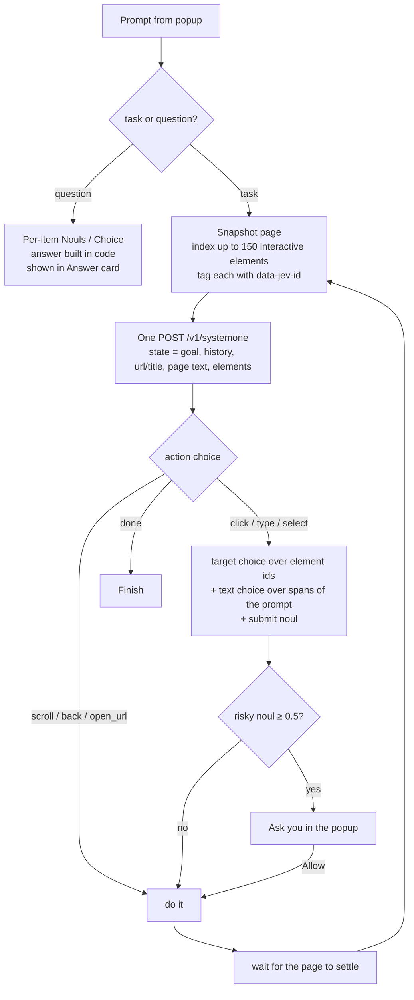

# Jev Browser Agent (Chrome extension)

Click the toolbar icon (or press **Alt+J**), type what you want done on the current page, and press **Run**. The extension uses TypeSafe's **Jev** model to drive the tab one step at a time.

## Install

1. Open `chrome://extensions` and turn on **Developer mode**.
2. Click **Load unpacked** and pick this folder.
3. Open the popup, click ⚙, paste your TypeSafe API key (from [console.typesafe.ai](https://console.typesafe.ai)), and click **Save**.

No build step or dependencies are needed.

## Asking questions about the page

The first request classifies the prompt: a **task**, or a question about the page (yes/no, count, list, or lookup). Questions skip the action loop, and the answer appears in a green **Answer** card in the popup, with a Copy button. Jev can't write an answer, so code builds one from its typed judgements:

| Question type | Example | How it's answered |
| --- | --- | --- |
| yes/no | "Is this repo MIT licensed?" | One Noul over the page text. Borderline results (30–70%) are flagged |
| count | "How many directories do you see?" | One Noul per page item ("is this one of the things asked about?"), tallied **in code**. Jev doesn't count reliably, so it's never asked to |
| list | "Which files are markdown?" | Same per-item Nouls; the matches are listed |
| lookup | "What's the latest release version?" | One Choice over the page items, plus a "not found" option. Close runners-up are shown too |

Page items are the interactive elements (with their link targets, which often carry the meaning: `/tree/` is a folder and `/blob/` is a file on GitHub) plus lines of visible text. Matched elements are outlined in green on the page for 8 seconds so you can check the answer. Items with 30–50% probability are listed as borderline and not counted.

## How it works

Jev is a System One model: it picks answers from options and doesn't write free text. So your code stays in control, and Jev makes a few narrow decisions at each step:

- **Speculative fan-out:** each step asks all of its questions in one request: the next action, the target for each action type, the text to type, and whether to press Enter. Code reads only the answers that apply.
- **Text to type comes from your prompt.** `candidates.js` breaks the prompt into spans (quoted text first, then the words after "for", "type", "enter" and so on, then every other span), and Jev picks one. Put exact text in quotes for the best results, e.g. `search for "usb-c hub 7 port"`.
- **URLs:** if the prompt contains a web address, `open_url` becomes an option.
- **Confidence gating:** if an action or target comes back below *Min confidence* (default 0.3), the agent stops and shows the top options instead of guessing.
- **Safety:** before any click or submit, a Noul checks whether the step would buy, delete, send or post something. If so, you have to click **Allow**. You can turn this off in Settings.
- **Loop guard:** the agent stops if it would repeat the same step on the same page a third time, and after 6 scrolls in a row or *Max steps*.

The agent runs in the background service worker, so you can close the popup; reopen it to see progress. Links that open in a new tab are forced to open in the current tab so the agent can follow them.

## Files

| File | Role |
| --- | --- |
| `manifest.json` | MV3 manifest (activeTab, scripting, storage, tabs, `<all_urls>`) |
| `background.js` | Agent loop, question building, safety gate, run state |
| `jev.js` | `/v1/systemone` client with retry/backoff on 429/529 |
| `page.js` | Injected functions: `snapshotPage` (element index) and `performAction` |
| `candidates.js` | Text and URL candidate spans from the prompt |
| `popup.*` | Prompt box, live log, confirm dialog, settings |

## Limitations

- It can't type text that isn't in your prompt, such as a reply it composes itself. That would need a generative LLM next to Jev.
- It doesn't see inside iframes, shadow DOM or canvas, and it can't run on `chrome://` pages or the Chrome Web Store.
- It sends the page's URL, title, the first ~1500 characters of visible text, and element labels to TypeSafe. Password values are never sent.
