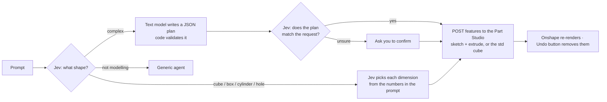
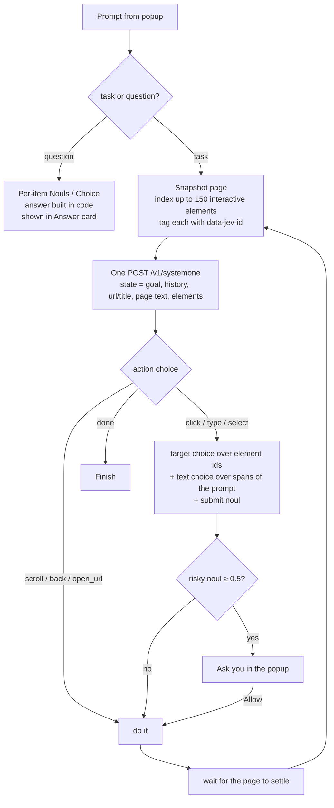

# Jev Browser Agent (Chrome extension)

Click the toolbar icon (or press **Alt+J**), type what you want done on the current page, and press **Run**. The extension uses TypeSafe's **Jev** model to drive the tab one step at a time.

## Install

1. Open `chrome://extensions` and turn on **Developer mode**.
2. Click **Load unpacked** and pick this folder.
3. Open the popup, click ⚙, paste your TypeSafe API key (from [console.typesafe.ai](https://console.typesafe.ai)), and click **Save**.

No build step or dependencies are needed.

## Side panel and right-click

- **◨** in the popup header moves Jev into Chrome's side panel, which stays open while you click around the page. To make the toolbar icon always open the panel, set *Toolbar icon opens → Side panel* in ⚙.
- Select text on any page, right-click, and choose **Ask Jev about "…"**. The side panel opens with the selection attached (shown as a chip above the prompt; ✕ removes it). Questions are then answered from the selection instead of the whole page. For example, "is this a good price?" gets a yes/no from the selection, "explain this" uses the text model, and "search for this" types the selection. **Ask Jev about this page** opens the panel without a selection.

## Find, hide and dim by meaning

Prompts like *"highlight reviews that mention battery life"*, *"hide sponsored results"* or *"dim posts about politics"* are recognised as find/hide requests:

1. `items.js` splits the page into items: groups of three or more same-shaped siblings with real text, such as search results, posts, comments, products and table rows. Navigation, header and footer groups are down-weighted. Pages without repeated blocks fall back to paragraphs and list items.
2. Each item gets one Jev Noul: "does this item match what the request describes?", sent in batches of 120. Answers are cached by item text, so re-renders cost nothing.
3. Matches (≥ 50%) are outlined, hidden or dimmed (dimmed items come back on hover). Items at 30–50% are listed as borderline and left alone.

The Answer card lists the matches. Click one, or use ◀ ▶, to scroll to it. **Clear highlights / Show hidden** undoes it. **Save as rule for <site>** keeps it: saved rules re-apply whenever a page on that site loads, and to new items as they appear (infinite scroll or app updates, via a MutationObserver). Only the new items are checked. The toolbar badge shows how many items rules hid or dimmed on the current tab. Rules for the current site are listed under the log, where you can switch each one off or delete it.

## Site skills: Onshape

Some web apps can't be driven through the page's HTML. In Onshape the toolbar is icons, the 3D view is a WebGL canvas, and a feature is a multi-step dialog, so the generic agent has nothing it can reliably click. For those sites the extension uses a **site skill**: a module that knows the app and works through the app's own API with your logged-in session, the same way your FeatureScript Exporter reads documents.

`skill_onshape.js` takes over on any `cad.onshape.com/documents/…/w/…/e/…` tab when the prompt is a modelling request:

- **Jev alone** handles a cube, box, cylinder or through-hole. It chooses the shape, and for each dimension it picks one of the numbers in your prompt (e.g. "60x40x20 mm" or "⌀20 mm, 40 mm tall"), or "not given", which falls back to a stated default.
- **Anything more complex** ("a 60×40×20 block with four 5 mm holes 8 mm from the corners") needs the text model. It writes a plan in a small typed vocabulary: boxes, cubes and cylinders on the Top, Front or Right plane, as new, add or remove operations, sized in mm. Code validates the plan, Jev checks it matches your request, and if Jev is under 50% sure you're asked to confirm the plan first.
- Each operation becomes a sketch (rectangle or circle) plus an extrude, or the standard cube feature. If Onshape reports an error, everything added in that run is deleted again. **Remove what Jev added** in the Answer card deletes the features afterwards; Onshape's own undo works too.
- Requests that aren't about geometry ("share this with Bob") go to the generic agent.

The generic agent also reads better labels for icon-only buttons now: tooltips, `data-*` titles, SVG titles and icon sprite names such as `#svg-icon-extrude-button`.

## Playing chess

The generic agent can't play chess. The pieces aren't buttons, and a game never finishes after one click (the first try clicked "Play as White" and reported done). So prompts that mention chess hand off to `skill_chess.js` once a board with your colour at the bottom is on the page. Before that, the normal agent handles setup, e.g. clicking "Play as Black".

Each move, code stays in control and Jev makes one decision:

1. **Read the position.** The skill uses a chess.js instance if the page has one (read from the page's own JavaScript). Otherwise it reads the board's `data-square` / `data-piece` markup (chessboard.js).
2. **Annotate every legal move in code** using a vendored copy of chess.js (`vendor/chess.mjs`, BSD-2): captures, checks, checkmate, promotion, "allows checkmate next move", and an estimate of material won or hung one move deep.
3. **Play a mate in one if there is one.** Drop moves that allow mate, and keep only moves within a pawn of the best material outcome.
4. **Jev picks.** One Choice over the remaining moves: "which is the strongest move for White here?". The state is the FEN, a piece list and recent moves, and each option carries its annotation. The log shows the move, its confidence and the runners-up.
5. **Make the move** by clicking the two squares, falling back to a mouse drag. Then wait for the opponent's reply (up to 2 minutes) and repeat until checkmate or a draw.

Tested end to end on jevfish.patebryant.com. It plays a full game, and its strength depends on Jev's choices plus one move of lookahead. It isn't meant for rated play on chess.com or lichess, where engine help breaks their fair-play rules, and it doesn't read their boards.

The generic agent also gained a **wait** action (the page is updating, or it's the other side's turn), and "done" now means an ongoing activity has actually finished.

## Text model (optional, LiveKit Inference)

Jev picks; it doesn't write. For text that isn't in your prompt, the extension can call an LLM through [LiveKit Inference](https://docs.livekit.io/agents/models/). In ⚙ → *Text model*, enter your LiveKit project URL, API key and secret, then choose a model (↻ loads the list from the gateway; you can also type any `provider/model` id). **Test text model** sends a one-word request and shows the reply and latency.

It's used in two places, and only when Jev asks for it:

- **Typing:** the `text` Choice gets a `compose` option ("the text isn't in the goal and has to be written"). If Jev picks it, the model writes the field's text from your goal, the page text and the field's label, e.g. *"reply to Ann saying I'll be there"*. The text it wrote is shown in the log. The usual risky-action check still runs before anything is sent.
- **Open questions:** a new prompt kind, *explain* ("summarize this page", "what does this function do"), streams a written answer into the Answer card, labelled with the model that wrote it. A *lookup* that Jev can't find as a single item on the page also falls back to the model.

Everything else (choosing actions, targets, yes/no, counts, lists) stays on Jev.

**How auth works:** the extension mints a short-lived (10 min) LiveKit access token with an `inference.perform` grant, signed HS256 with your API secret, the same token the LiveKit Agents SDK uses. It calls the OpenAI-compatible gateway (`https://agent-gateway.livekit.cloud/v1`, or the staging gateway if your URL is `*.staging.livekit.cloud`) at `/chat/completions` with streaming, and at `/models`. The secret is kept in `chrome.storage.local`, which is **not encrypted**, so use a key from a LiveKit project you're comfortable using for this.

## Asking questions about the page

The first request classifies the prompt: a **task**, or a question about the page (yes/no, count, list, or lookup). Questions skip the action loop, and the answer appears in a green **Answer** card in the popup, with a Copy button. Jev can't write an answer, so code builds one from its typed judgements:

| Question type | Example | How it's answered |
| --- | --- | --- |
| yes/no | "Is this repo MIT licensed?" | One Noul over the page text. Borderline results (30–70%) are flagged |
| count | "How many directories do you see?" | One Noul per page item ("is this one of the things asked about?"), tallied **in code**. Jev doesn't count reliably, so it's never asked to |
| list | "Which files are markdown?" | Same per-item Nouls; the matches are listed |
| lookup | "What's the latest release version?" | One Choice over the page items, plus a "not found" option. Close runners-up are shown too |

Page items are the interactive elements (with their link targets, which often carry the meaning: `/tree/` is a folder and `/blob/` is a file on GitHub) plus lines of visible text. Matched elements are outlined in green on the page for 8 seconds so you can check the answer. Items with 30–50% probability are listed as borderline and not counted.

## How it works

Jev is a System One model: it picks answers from options and doesn't write free text. So your code stays in control, and Jev makes a few narrow decisions at each step:

- **Speculative fan-out:** each step asks all of its questions in one request: the next action, the target for each action type, the text to type, and whether to press Enter. Code reads only the answers that apply.
- **Text to type comes from your prompt.** `candidates.js` breaks the prompt into spans (quoted text first, then the words after "for", "type", "enter" and so on, then every other span), and Jev picks one. Put exact text in quotes for the best results, e.g. `search for "usb-c hub 7 port"`.
- **URLs:** if the prompt contains a web address, `open_url` becomes an option.
- **Confidence gating:** if an action or target comes back below *Min confidence* (default 0.3), the agent stops and shows the top options instead of guessing.
- **Safety:** before any click or submit, a Noul checks whether the step would buy, delete, send or post something. If so, you have to click **Allow**. You can turn this off in Settings.
- **Loop guard:** the agent stops if it would repeat the same step on the same page a third time, and after 6 scrolls in a row or *Max steps*.

The agent runs in the background service worker, so you can close the popup; reopen it to see progress. Links that open in a new tab are forced to open in the current tab so the agent can follow them.

## Files

| File | Role |
| --- | --- |
| `manifest.json` | MV3 manifest (activeTab, scripting, storage, tabs, sidePanel, contextMenus, `<all_urls>`) |
| `background.js` | Agent loop, question building, safety gate, run state |
| `jev.js` | `/v1/systemone` client with retry/backoff on 429/529 |
| `items.js` | Injected functions for find/hide: page segmentation, marking, jump-to, mutation watcher, selection |
| `rules.js` | Per-item judging with cache, one-off find/hide, saved per-site rules and auto-apply |
| `skill_onshape.js` | Onshape: plan (Jev, or text model + Jev check), build features through the Part Studio API with the session, undo |
| `skill_chess.js` | Chess: read the position, annotate legal moves, Jev picks, click/drag the move, wait for the reply |
| `vendor/chess.mjs` | chess.js 0.10.3 (BSD-2-Clause) with an ES-module export appended |
| `lk.js` | LiveKit Inference client: token minting (WebCrypto HMAC), model list, streaming chat |
| `page.js` | Injected functions: `snapshotPage` (element index) and `performAction` |
| `candidates.js` | Text and URL candidate spans from the prompt |
| `popup.*` | Prompt box, live log, confirm dialog, answer card, site rules, settings. The same page is the side panel (`popup.html?panel=1`) |

## Limitations

- Without a text model configured, it can't type text that isn't in your prompt, and it can't answer open questions.
- It doesn't see inside iframes, shadow DOM or canvas, and it can't run on `chrome://` pages or the Chrome Web Store.
- Saved rules send the text of each new page item (up to 400 characters each) to TypeSafe as pages on that site load and scroll.
- It sends the page's URL, title, the first ~1500 characters of visible text, and element labels to TypeSafe. With a text model set up, it also sends up to ~16,000 characters of page text to LiveKit Inference when it writes text or answers an open question. Password values are never sent.
