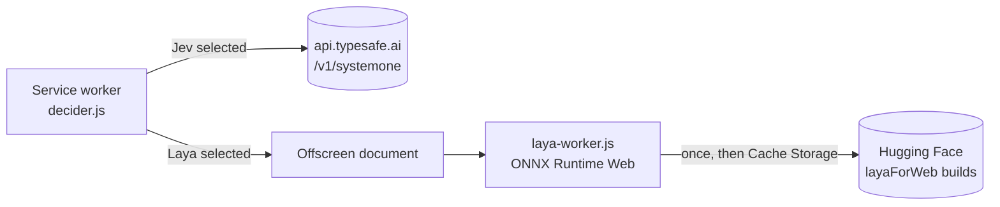
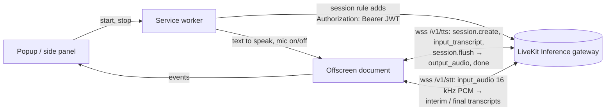
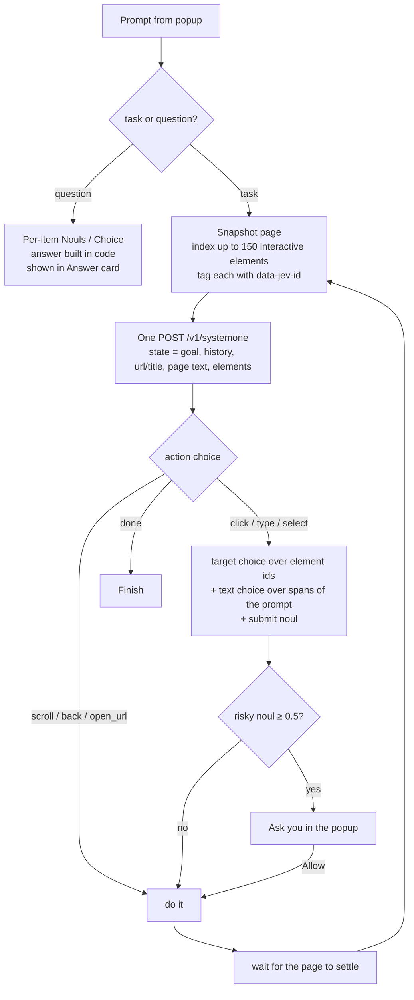

# Docent (Chrome extension)

A guide for the page you're on. Like a museum docent, it explains what's in front of you, reads it to you, points at what it's talking about, and can act for you.

Click the toolbar icon (or press **Alt+J**), type what you want done on the current page, and press **Run**. Docent uses TypeSafe's **Jev** model to make its decisions and drive the tab one step at a time, or **Laya**, a similar decision model that runs entirely in your browser with no key (see [Jev or Laya](#jev-or-laya)).

## Install

1. Open `chrome://extensions` and turn on **Developer mode**.
2. Click **Load unpacked** and pick this folder.
3. Open the popup, click ⚙, and either paste your TypeSafe API key (from [console.typesafe.ai](https://console.typesafe.ai)) or set *Who makes the decisions* to **Laya**. Click **Save**.

No build step or dependencies are needed.

## Jev or Laya

⚙ → *Decision model* picks what makes the typed decisions (which kind of request, which element to click, does this post match, yes or no):

| | Jev | Laya |
| --- | --- | --- |
| Where it runs | TypeSafe's API | In your browser (ONNX Runtime Web, WebGPU or CPU) |
| Needs | A TypeSafe API key | A one-time download: 290 MB (int4) or 440 MB (int8), cached afterwards |
| Page text sent out | To TypeSafe | Nowhere |
| Speed | About a second a step | Seconds per question on CPU; faster with the GPU (int4 build) |
| Accuracy | Best | Good at yes/no questions and find/hide by meaning; weaker at multi-step tasks |

Laya is the English [Laya](https://huggingface.co/convaiinnovations/laya) checkpoint from ConvAI Innovations (Apache-2.0), converted for the browser by [layaForWeb](https://github.com/vishalmysore/layaForWeb). It takes the same `state` + typed `questions` as Jev and returns the same answers, so the rest of the extension doesn't change. It reads a shorter window (512 tokens of context, 1,024 for the typed-decisions checkpoint) and scores about 10 options per question well, so `decider.js` adapts the questions for it:

- **Per-item checks** (find, hide, count, list) put each item's text in the context and ask a plain statement ("The text is one of the things meant by: sponsored posts"). On a test feed this got 22 to 23 of 24 right, against 16 to 18 for list-style questions.
- **Many options** (which of 60 elements to click) go through knockout rounds of 10.
- **Next step:** instead of Jev's "which action, then which element", Laya picks from concrete steps ("click link 'Sign in'", "type "red shoes" into text field 'Search'"), and the probability of the chosen step is its confidence.
- **Understanding the prompt:** clear-cut wording is sorted by rules ("hide …", "how many …", "summarize …"), then by the text model if one is set up, and only then by Laya.
- Fewer elements and items per pass (60 elements, 80 items), since each question costs real compute.

The model runs in a module worker (`laya-worker.js`) started by the offscreen document, so it stays loaded while you browse. The extension pages are cross-origin isolated (`cross_origin_embedder_policy`), which lets the CPU build use several threads. *Download & load now* fetches it ahead of time; *Delete download* removes it from the browser. There are two checkpoints: **general** (default) and **typed decisions** (fine-tuned for typed decisions; in these tests it was better at telling tasks from questions and worse at picking the next step). The int8 build only runs on the CPU, because ONNX Runtime's WebGPU kernel supports 4-bit weights only.

## Voice: read aloud, spoken answers, ask by voice

Voice uses LiveKit Inference text-to-speech and speech-to-text with the same LiveKit URL, key and secret as the text model. Pick a voice and a speech-to-text model in ⚙ → *Voice*; ▶ plays a sample.

- **🔊 Read this page aloud.** Reads the page's main text (article or main content, without navigation, headers and footers), or your selection if you right-clicked some text. "Read this page to me" typed in the prompt does the same. The whole page is read a chunk at a time (about two screens each), starting from what's on screen. When a chunk finishes, Jev takes the next one and scrolls down to it, expanding "…see more" as it goes. At the end of the loaded content it scrolls to the bottom so feeds load more posts, and it keeps going until nothing more appears ("That's the end of the page.") or you press ■ Stop. In a conversation, "stop" pauses and "continue" picks up at the sentence you stopped at.
- **🎧 Podcast mode.** "Make this a podcast", "turn this post into a podcast" or the 🎧 button: the text model writes a short script for two hosts discussing the article, post, thread or selection (the same outline → locate → extract step picks the part you mean), and two different voices perform it. One host explains the piece and the other asks the questions a listener would. The first host starts talking as soon as the first line is written. It runs about 3 minutes by default; "a 5 minute podcast", "a quick podcast" or "a detailed podcast" change the length. The hosts are your main voice plus a contrasting one (⚙ → *Second podcast voice* to choose it). The Podcast card shows the transcript and follows the line being spoken. ■ Stop ends it; in a conversation, "stop" pauses and "continue" resumes at the same line.
  - **It shows what they're talking about.** Before writing, the page (or the located post) is split into numbered text blocks `[p12]` and images, charts and videos `[m3]` (described by their alt text and caption, `podsource.js`). The script cites the blocks each line is about, e.g. `Blake: So sales doubled? [p14, m2]`. While that line plays, its text is highlighted in blue on the page, an image or chart it mentions gets a blue outline, and the page scrolls to bring it into view. The ids are never spoken or shown in the transcript.
  - **Expressive voices** (⚙ → *Expressive podcasts*, on by default). The script marks each line's delivery (emotion, pauses, emphasis, laughs) the way [LiveKit's expressive mode](https://livekit.com/blog/making-voice-agents-sound-human-with-expressive-mode) does. The text model writes `<expr type="expression" label="excited"/>`-style markers, taught with the same per-provider instructions as the Agents SDK, and `expressive.js` converts them to each host's native markup before speaking: Cartesia sonic-3 gets `<emotion value="excited"/>`, `<break time="500ms"/>` and speed/volume tags; Fish Audio s2 gets `[very excited]`, `[laughing]`, `[break]` and `[emphasis] word`. The two hosts can use different providers; each line is converted for its own speaker's voice. Voices without expressive support (such as Deepgram) have the markers removed. The conversion is a port of the SDK's `convert_markup` and matched its output on every test case.
  - **⬇ Download MP3.** Saves the whole show to `Downloads/Docent podcasts/` to listen to later. Turns you've already heard are reused; the rest are synthesized without playing (faster than real time). Both voices are joined with short pauses and encoded as a 64 kbps mono MP3 with LAME (`vendor/lamejs.mjs`, LGPL). You can download without listening first: press ■ Stop, then ⬇.
- **⏸ Pause / ▶ Resume.** While Docent is speaking, the voice bar has ⏸ Pause (or press **Alt+Shift+P**). It freezes the audio mid-word, along with the read-along highlight and scrolling, and ▶ Resume continues from the same spot. It works for page reading, podcasts and spoken answers. In a conversation, say "pause", "hold on" or "one second", then "continue" or "resume".
- **What next?** After each run, a row of clickable suggestions appears under the answer, e.g. *Summarize this page*, *🎧 Make it a podcast*, *🔊 Read this page aloud*. With a text model set up, up to three page-specific ideas (marked ✦) are added, such as "Hide sponsored posts" on a feed. Clicking one stops anything being read out and runs it.
- **Reading or summarizing one part of a page.** "Read the post I'm looking at", "read the post from Jane Doe", "summarize this article" or "what does the second comment say" work on just that part (`targets.js`):
  1. **Outline:** `outline.js` walks the page's text in the tab. Each text node belongs to its nearest block-level element, and each block becomes one outline line with an id, whether it's on screen, above or below, and whether it looks like a heading or a button. This doesn't depend on class names or page structure, so it copes with LinkedIn's hashed classes and uneven nesting.
  2. **Locate:** the text model reads the outline (up to about 700 lines around the screen) and returns the range of lines the request means, e.g. `{"start":"b28","end":"b41","label":"Post by Rhodri Hughes"}`, or "whole page". "This / current / looking at" means the item on screen. Without a text model, Jev picks the starting heading or author line with a Choice, and the range ends before the next line that looks the same.
  3. **Extract:** the range's full text is collected with "…see more" expanded first. Buttons, reaction and comment counts, timestamps, connection labels and screen-reader duplicate text are left out. The page scrolls to it while it's read.
- **Spoken answers.** "Summarize this page" and other open questions stream from the text model into TTS sentence by sentence, so speech starts before the answer is finished. Short answers (yes/no, counts, lists, found/hidden items, task results) are spoken too. Answers are spoken when you asked with the mic, when your prompt asks for it ("tell me…", "read it out"; Jev checks with a Noul), or always if you tick *Always speak answers aloud*. 🔊 on the Answer card replays one. ■ Stop cuts it off.
- **Read-along highlight.** While Docent reads a page, a post or your selection, the sentence being spoken is highlighted on the page in yellow, with the last few already-read sentences faintly shaded, and the page scrolls to follow it. Each spoken sentence is matched to the page text on letters and digits only, so bullets, line breaks and punctuation don't throw it off. The highlight uses the CSS Custom Highlight API, so the page's HTML isn't changed. The player reports which sentence is playing, estimated from each sentence's share of the audio.
- **💬 Hands-free conversation** (or **Alt+Shift+J**). The mic stays open and each pause ends what you said. Docent answers out loud, and you can talk over it to interrupt. Follow-ups work: "tell me more about it" or "what about the second post?" is rewritten into a standalone request using the conversation so far, and the conversation is given to the text model with the page. Spoken commands:
  - "stop", "wait", "quiet": stop talking and keep listening
  - "continue", "go on": resume reading at the sentence where you interrupted
  - "repeat that": say the last answer again
  - "stop listening", "that's all", "goodbye": end the conversation

  Docent's own voice coming back through the mic is ignored: a transcript is dropped when most of its words are words Docent is saying. It stops listening after 2 minutes of silence. The side panel shows the exchange as chat bubbles. It keeps working with the popup closed, since audio and turn-taking live in the offscreen document and service worker (`conversation.js`).
- **🎤 Ask by voice.** Click the mic and talk. Your words appear in the prompt box as you speak, and a short pause after a finished sentence (or clicking 🎤 again) sends it. The reply is spoken. The first time, Chrome asks for microphone permission in a small tab.

How it works:

- Audio plays and the mic is captured in an **offscreen document** (`offscreen.html`), so speech keeps going after the popup closes.
- Browser WebSockets can't send headers, so the service worker adds `Authorization: Bearer <token>` to the gateway's WebSocket handshake with a `declarativeNetRequest` session rule. The token is the same short-lived LiveKit token as the text model, minted per session.
- TTS is 24 kHz 16-bit PCM, scheduled gap-free through Web Audio. STT is 16 kHz PCM from the mic.

## PDFs

Chrome shows PDFs in its built-in viewer, which extensions can't read or script. So on a PDF tab, Docent downloads the file itself (with your cookies, so PDFs behind a login work too) and extracts the text with [pdf.js](https://github.com/mozilla/pdf.js) (Apache-2.0) in the offscreen document (`pdfdoc.js`, `offscreen.js`). It rebuilds paragraphs and section headings from the text positions, drops page numbers and rotated side text (like arXiv's stamp), and rejoins words hyphenated across lines. The Attention Is All You Need paper comes out as 202 paragraphs with every section heading found. The result is cached per URL.

What works on a PDF:

- **Questions and summaries** ("summarize this paper", "what dataset did they use?", "is there a code link?") use the PDF's text, up to about 48,000 characters.
- **Sections:** "read the conclusion", "summarize section 3.2" or "podcast of the related work": the text model picks the paragraphs from an outline of the PDF labelled by page.
- **Reading aloud** reads the title, skips the author list, starts at the Abstract and stops before the references. **The viewer follows along:** Docent turns Chrome's PDF viewer to the page being read (`#page=N`). There's no sentence highlight, since the viewer can't be marked up. ⏸, ■ and "continue" work as usual.
- **Podcasts** number the PDF's paragraphs so each line cites what it's about, and the viewer turns to the page being discussed. ⬇ Download MP3 works the same.
- **Not possible in the viewer:** clicking or typing, and find/hide/dim. Docent says so instead of trying.

Local files (`file://…pdf`) need *Allow access to file URLs* on Docent's details page in `chrome://extensions`. Very long PDFs are read up to their first 80 pages.

## Side panel and right-click

- **◨** in the popup header moves Docent into Chrome's side panel, which stays open while you click around the page. To make the toolbar icon always open the panel, set *Toolbar icon opens → Side panel* in ⚙.
- Select text on any page, right-click, and choose **Ask Docent about "…"**. The side panel opens with the selection attached (shown as a chip above the prompt; ✕ removes it). Questions are then answered from the selection instead of the whole page. For example, "is this a good price?" gets a yes/no from the selection, "explain this" uses the text model, and "search for this" types the selection. **Ask Docent about this page** opens the panel without a selection.

## Find, hide and dim by meaning

Prompts like *"highlight reviews that mention battery life"*, *"hide sponsored results"* or *"dim posts about politics"* are recognised as find/hide requests:

1. `items.js` splits the page into items: groups of three or more same-shaped siblings with real text, such as search results, posts, comments, products and table rows. Navigation, header and footer groups are down-weighted. Pages without repeated blocks fall back to paragraphs and list items.
2. Each item gets one Jev Noul: "does this item match what the request describes?", sent in batches of 120. Answers are cached by item text, so re-renders cost nothing.
3. Matches (≥ 50%) are outlined, hidden or dimmed (dimmed items come back on hover). Items at 30–50% are listed as borderline and left alone.

The Answer card lists the matches. Click one, or use ◀ ▶, to scroll to it. **Clear highlights / Show hidden** undoes it. **Save as rule for <site>** keeps it: saved rules re-apply whenever a page on that site loads, and to new items as they appear (infinite scroll or app updates, via a MutationObserver). Only the new items are checked. The toolbar badge shows how many items rules hid or dimmed on the current tab. Rules for the current site are listed under the log, where you can switch each one off or delete it.

## Text model (optional, LiveKit Inference)

Your LiveKit URL, API key and secret are in [LiveKit Cloud → Settings → API keys](https://cloud.livekit.io/projects/p_/settings/keys) (sign in, then *Create key*). Settings links there too.

Jev picks; it doesn't write. For text that isn't in your prompt, the extension can call an LLM through [LiveKit Inference](https://docs.livekit.io/agents/models/). In ⚙ → *Text model*, enter your LiveKit project URL, API key and secret, then choose a model (↻ loads the list from the gateway; you can also type any `provider/model` id). **Test text model** sends a one-word request and shows the reply and latency.

It's used in two places, and only when Jev asks for it:

- **Typing:** the `text` Choice gets a `compose` option ("the text isn't in the goal and has to be written"). If Jev picks it, the model writes the field's text from your goal, the page text and the field's label, e.g. *"reply to Ann saying I'll be there"*. The text it wrote is shown in the log. The usual risky-action check still runs before anything is sent.
- **Open questions:** a new prompt kind, *explain* ("summarize this page", "what does this function do"), streams a written answer into the Answer card, labelled with the model that wrote it. A *lookup* that Jev can't find as a single item on the page also falls back to the model.

Everything else (choosing actions, targets, yes/no, counts, lists) stays with the decision model (Jev or Laya).

**How auth works:** the extension mints a short-lived (10 min) LiveKit access token with an `inference.perform` grant, signed HS256 with your API secret, the same token the LiveKit Agents SDK uses. It calls the OpenAI-compatible gateway (`https://agent-gateway.livekit.cloud/v1`, or the staging gateway if your URL is `*.staging.livekit.cloud`) at `/chat/completions` with streaming, and at `/models`. The secret is kept in `chrome.storage.local`, which is **not encrypted**, so use a key from a LiveKit project you're comfortable using for this.

## Asking questions about the page

The first request classifies the prompt: a **task**, or a question about the page (yes/no, count, list, or lookup). Questions skip the action loop, and the answer appears in a green **Answer** card in the popup, with a Copy button. Jev can't write an answer, so code builds one from its typed judgements:

| Question type | Example | How it's answered |
| --- | --- | --- |
| yes/no | "Is this repo MIT licensed?" | One Noul over the page text. Borderline results (30–70%) are flagged |
| count | "How many directories do you see?" | One Noul per page item ("is this one of the things asked about?"), tallied **in code**. Jev doesn't count reliably, so it's never asked to |
| list | "Which files are markdown?" | Same per-item Nouls; the matches are listed |
| lookup | "What's the latest release version?" | One Choice over the page items, plus a "not found" option. Close runners-up are shown too |

Page items are the interactive elements (with their link targets, which often carry the meaning: `/tree/` is a folder and `/blob/` is a file on GitHub) plus lines of visible text. Matched elements are outlined in green on the page for 8 seconds so you can check the answer. Items with 30–50% probability are listed as borderline and not counted.

## How it works

Jev is a System One model: it picks answers from options and doesn't write free text. So your code stays in control, and Jev makes a few narrow decisions at each step:

- **Speculative fan-out:** each step asks all of its questions in one request: the next action, the target for each action type, the text to type, and whether to press Enter. Code reads only the answers that apply.
- **Text to type comes from your prompt.** `candidates.js` breaks the prompt into spans (quoted text first, then the words after "for", "type", "enter" and so on, then every other span), and Jev picks one. Put exact text in quotes for the best results, e.g. `search for "usb-c hub 7 port"`.
- **URLs:** if the prompt contains a web address, `open_url` becomes an option.
- **Confidence gating:** if an action or target comes back below *Min confidence* (default 0.3), the agent stops and shows the top options instead of guessing.
- **Safety:** before any click or submit, a Noul checks whether the step would buy, delete, send or post something. If so, you have to click **Allow**. You can turn this off in Settings.
- **Loop guard:** the agent stops if it would repeat the same step on the same page a third time, and after 6 scrolls in a row or *Max steps*.

The agent runs in the background service worker, so you can close the popup; reopen it to see progress. Links that open in a new tab are forced to open in the current tab so the agent can follow them.

## Files

| File | Role |
| --- | --- |
| `manifest.json` | MV3 manifest (activeTab, scripting, storage, tabs, sidePanel, contextMenus, offscreen, declarativeNetRequest, `<all_urls>`) |
| `background.js` | Agent loop, question building, safety gate, run state |
| `jev.js` | `/v1/systemone` client with retry/backoff on 429/529 |
| `items.js` | Injected functions for find/hide: page segmentation, marking, jump-to, mutation watcher, selection |
| `rules.js` | Per-item judging with cache, one-off find/hide, saved per-site rules and auto-apply |
| `conversation.js` | Hands-free conversation: turn-taking, spoken commands, follow-up rewriting, idle timeout |
| `decider.js` | Jev or Laya: routes typed questions to the TypeSafe API or the in-browser model, and adapts them for Laya |
| `laya-worker.js` | Laya in a module worker: download and cache the model, pick WebGPU or CPU, answer questions |
| `vendor/laya/` | ONNX Runtime Web 1.30 (MIT), tokenizers.js (MIT) and layaForWeb's `laya-core.js` (Apache-2.0), with their licences and notice |
| `pdfdoc.js` | PDFs: detect a PDF tab, extract and cache its text (via the offscreen document), reading chunks, turn the viewer's page |
| `vendor/pdfjs/` | pdf.js 5.7 legacy build (Apache-2.0) and its CMaps, for reading PDFs |
| `expressive.js` | Expressive podcasts: per-provider marker instructions and lowering to Cartesia/Fish Audio markup (port of LiveKit Agents' expressive mode) |
| `podsource.js` | Podcast: number the page's blocks and images/charts, highlight and scroll to the ones being discussed |
| `vendor/lamejs.mjs` | LAME MP3 encoder (LGPL-3.0, unmodified, licence in `vendor/LAME-LICENSE.txt`) for podcast downloads |
| `podcast.js` | Podcast mode: two hosts and voices, streamed script writing, turn-by-turn playback with pause/resume |
| `karaoke.js` | Read-along highlight: find spoken sentences on the page, highlight and follow the current one; progressive page reader (next chunk, load more) |
| `voice.js` | Voice: TTS/STT sessions, gateway auth rule, text clean-up for speech, suggested voices |
| `offscreen.*` | Offscreen document: TTS WebSocket + audio playback, mic capture + STT WebSocket |
| `mic.*` | One-time page to grant microphone permission |
| `lk.js` | LiveKit Inference client: token minting (WebCrypto HMAC), model list, streaming chat |
| `page.js` | Injected functions: `snapshotPage` (element index) and `performAction` |
| `candidates.js` | Text and URL candidate spans from the prompt |
| `popup.*` | Prompt box, live log, confirm dialog, answer card, site rules, settings. The same page is the side panel (`popup.html?panel=1`) |

## Limitations

- Without a text model configured, it can't type text that isn't in your prompt, and it can't answer open questions.
- It doesn't see inside iframes, shadow DOM or canvas, and it can't run on `chrome://` pages or the Chrome Web Store.
- Saved rules send the text of each new page item (up to 400 characters each) to TypeSafe as pages on that site load and scroll (with Jev; with Laya nothing leaves the browser).
- Laya is noticeably less reliable than Jev at multi-step tasks and subtle matches, and on a CPU a step can take several seconds. Its confidence numbers aren't comparable to Jev's.
- With Jev, it sends the page's URL, title, the first ~1500 characters of visible text, and element labels to TypeSafe. With a text model set up, it also sends up to ~16,000 characters of page text to LiveKit Inference when it writes text or answers an open question. Password values are never sent.
